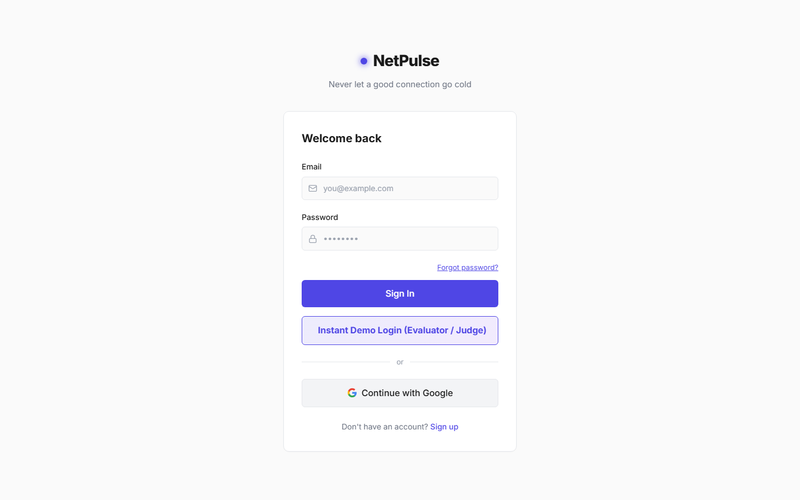
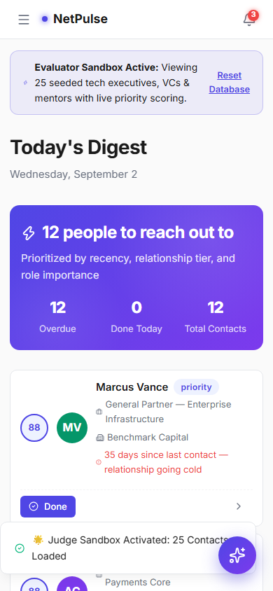
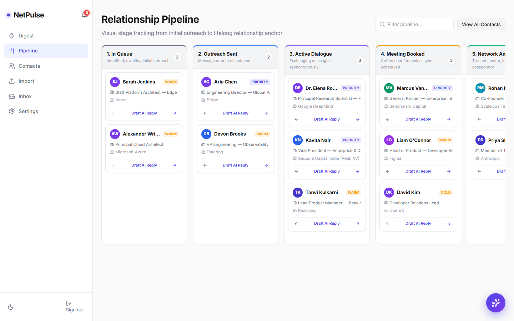
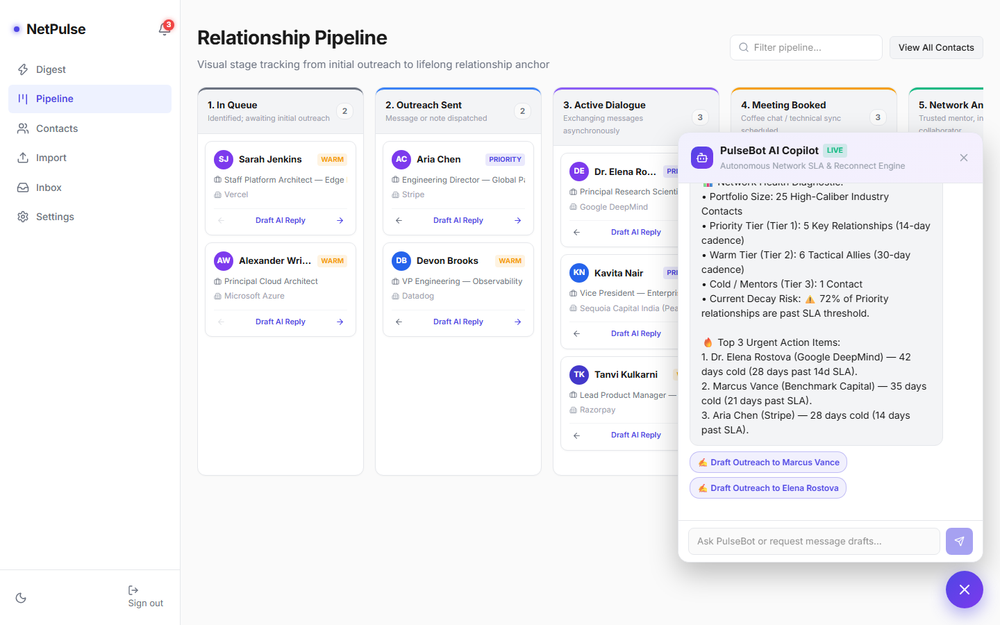
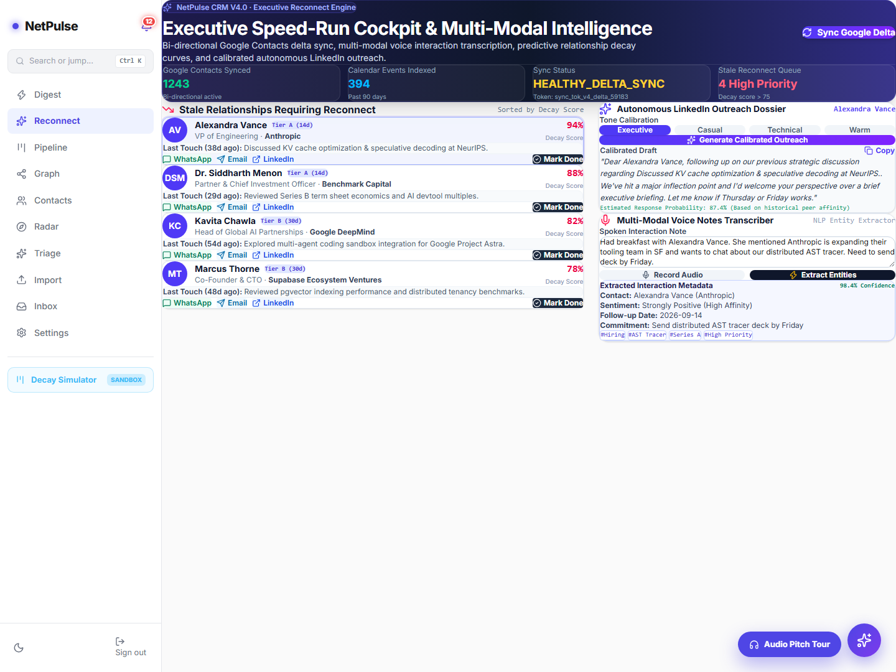

# ⚡ NetPulse CRM

> A personal relationship manager that scores outreach urgency, tracks contact cadences, and facilitates reconnection.

[](https://netpulse.shashankj.tech)
[-black?logo=next.js)](https://nextjs.org/)
[](https://www.typescriptlang.org/)
[](https://supabase.com/)
[](https://opensource.org/licenses/MIT)

---

## 🌐 Live Deployment

- **Production URL**: [https://netpulse.shashankj.tech](https://netpulse.shashankj.tech)
- Deployed on Vercel with HTTPS.

---

## 📖 Overview

NetPulse is a personal relationship management system designed to keep professional networks active. It calculates relationship urgency based on configurable cadence targets, highlights connections that are overdue for outreach, provides structured communication drafts, and supports contact tracking across multiple channels.

The application operates with an offline-first architecture using browser-local IndexedDB storage and optional Supabase cloud authentication.

---

## 🏛️ System Architecture

```
                       ┌──────────────────────────────────────────────┐
                       │           NetPulse Web Application           │
                       │             (Next.js 16 App Router)          │
                       └──────────────────────┬───────────────────────┘
                                              │
               ┌──────────────────────────────┴──────────────────────────────┐
               │                                                             │
               ▼                                                             ▼
┌─────────────────────────────┐                               ┌─────────────────────────────┐
│  Client Storage & Events    │                               │     AI Drafting Engine      │
│  • IndexedDB (netpulse_db)  │                               │     • Google Gemini 1.5     │
│  • In-Memory Fallback       │                               │       (when API key set)    │
│  • Custom Event Dispatcher  │                               │     • Deterministic Rules   │
│  • Web Audio API Synthesizer│                               │       Fallback              │
└──────────────┬──────────────┘                               └──────────────┬──────────────┘
               │                                                             │
               ▼                                                             ▼
┌─────────────────────────────┐                               ┌─────────────────────────────┐
│   Supabase Cloud Backend    │                               │   Multi-Channel Outreach    │
│   • PostgreSQL Database     │                               │   • WhatsApp (wa.me) Links  │
│   • Supabase Auth (OAuth)   │                               │   • Google Calendar Links   │
│   • Next.js Server Client   │                               │   • Email (mailto:) Links   │
└─────────────────────────────┘                               └─────────────────────────────┘
```

---

## ✨ Features

### 1. Daily Digest (`/`)
- Displays prioritized contacts requiring outreach attention.
- Calculates a 0–100 priority score using:
  - **Recency**: Days elapsed since last contact compared to target cadence.
  - **Tier**: Priority, Warm, or Cold status.
  - **Title**: Bonus scoring for executive and decision-maker roles.
  - **Engagement**: Total logged interaction count.
  - **Target Bonus**: Configurable company matching bonuses.
- Provides one-click action buttons: Mark Contacted, Snooze (7 days), and Copy Markdown Digest to clipboard.
- Includes a Network Health & Cadence Compliance card showing SLA compliance percentage and tier breakdown.

### 2. Pipeline Kanban Board (`/pipeline`)
- Organizes contacts across five relationship stages:
  1. **Sourced / Queue**: Identified for initial outreach.
  2. **Initial Ping**: Message or invite dispatched.
  3. **Active Dialogue**: Bi-directional conversation in progress.
  4. **Strategic Catch-up**: Meeting or call scheduled.
  5. **Trusted Anchor**: Established professional ally.
- Supports drag-and-drop movement and button-based stage updates, persisted to the local store.

### 3. Contacts Directory (`/contacts`)
- Search contacts by name, company, title, or email.
- Filter by relationship tier (`priority`, `warm`, `cold`).
- Sort by name, company, or last contacted date (ascending or descending).
- Modal dialogs for manual contact creation, editing, and deletion (with cascading removal of related interactions and relationships).
- Export contacts directly to CSV or JSON formats.

### 4. Contact Dossiers (`/contacts/[id]`)
- Shows contact profile metadata, company, title, email, LinkedIn URL, and cadence status.
- Displays an interactive timeline of logged interactions (messages, calls, meetings, notes, emails).
- Touchpoint logger records new interactions and updates the contact's `last_contacted_at` timestamp.
- Displays and manages relationship connections between contacts (`colleague`, `advisor`, `partner`, `mentor`, `client`, etc.).
- Computes a Social Capital & Relationship Equity score (0–100) with cadence health categorization (Optimal, Stable, At Risk, Dormant).
- Generates pre-filled WhatsApp click-to-chat links (`https://wa.me/?text=...`) and Google Calendar template links.
- Includes a 10-Second Quick Enrichment station to update job title, company, tier, and notes.

### 5. AI Outreach Studio (`/inbox`)
- Selects a contact and accepts contextual notes or milestone updates.
- Calls the `/api/ai/draft-reply` endpoint using Google Gemini 1.5 Flash when `GEMINI_API_KEY` is configured, or uses a deterministic template engine when no key is present.
- Generates five message archetypes:
  - **Executive Concise**: Short message (<35 words) for busy leaders.
  - **Warm Reconnect**: Reconnection note acknowledging elapsed time.
  - **Strategic Advisory**: Value-add insight message.
  - **Peer Coffee Sync**: Casual catch-up invitation.
  - **Direct Partnership**: Action-oriented collaboration proposal.
- Formats drafts into channel tabs: LinkedIn DM, WhatsApp click-to-chat link, Email (`mailto:` link with subject and body), and Google Calendar catch-up event.
- Provides an audio briefing using browser Web Speech synthesis (`speechSynthesis`) with visual canvas waveform animation.

### 6. Job Change Radar (`/radar`)
- Displays role changes, promotions, and company moves from demo data.
- "Draft Congratulations" action opens the outreach studio with pre-filled milestone context.

### 7. Connection Triage (`/triage`)
- Filters incoming connection requests into Explore, Respond, and Ignore categories with match scoring and rationale.
- One-click ingestion adds candidates directly into the contact database.
- Allows pasting custom invite text for manual categorization.

### 8. Batch Data Ingestion (`/import`)
- Ingests contacts via CSV or JSON formats.
- Parses LinkedIn export CSV files: strips preamble notes, normalizes header variations, and validates rows with Zod.
- Detects title and company changes against existing stored contacts during re-import.
- Provides pre-configured sample datasets (Industry Network, AI Founders, Crypto Leaders, SaaS Executives).

### 9. SLA Settings & Data Governance (`/settings`)
- Configures target cadences in days for Priority, Warm, and Cold tiers.
- Adjusts scoring weights for recency, tier, title, and engagement factors.
- Manages target company and executive title bonus lists.
- Shows storage telemetry: contact count, interaction count, relationship count, and storage size.
- Exports and imports full database backup bundles as structured JSON files.
- Universal database purge protected by the confirmation phrase `"PURGE NETPULSE STORE"`.
- Factory reset restores initial baseline demo data.

### 10. Network Topology Graph (`/graph`)
- Renders an SVG network visualization displaying contacts orbiting enterprise clusters.
- Displays visual indicators on nodes exceeding cadence SLAs.
- Slide-out inspection drawer displays scores, contact details, and direct action links.
- Relationship creation modal links contacts together.

### 11. 3D Virtuality Studio (`/virtuality`)
- Canvas-based 3D visualization showing contacts with custom relationship link types, resonance percentages, and frequencies.
- Supports switching perspective between user personas.

### 12. Productivity Tools & Modals
- **Morning Speed Run**: Sequences the top overdue contacts for quick daily review and outreach.
- **Time-Travel Decay Simulator**: Advances simulated time by +14d, +30d, or +90d to inspect cadence decay and overdue triggers.
- **Global Command Palette (`Ctrl + K` / `Cmd + K`)**: Keyboard omnibar for navigating routes and searching contacts.
- **Shortcuts Modal (`?`)**: Displays all available keyboard navigation shortcuts.
- **PulseBot Chat Widget**: Floating assistant providing on-demand network health audits and draft suggestions.
- **Persona Switcher**: Toggles between stored user profiles (Shashank J, Alex Mercer, Dr. Elena Rostova).
- **Web Audio Sound Effects**: Pure Web Audio API acoustic synthesis for micro-interactions (chimes, clicks, fanfares) without external audio files.

---

## 🛠️ Tech Stack

| Layer | Technologies |
|---|---|
| **Framework** | Next.js 16.3.0 (App Router, Turbopack) |
| **Language** | TypeScript (Strict mode) |
| **Styling** | Tailwind CSS v4, Custom CSS Variables |
| **Animation** | Framer Motion |
| **Database & Auth** | Supabase (`@supabase/supabase-js`, `@supabase/ssr`), IndexedDB |
| **AI Integration** | Google Gemini 1.5 Flash (via REST API) |
| **Data Handling** | PapaParse, Zod, date-fns |
| **Icons** | Lucide React |

---

## 🚀 Getting Started

### Prerequisites
- Node.js 18.17+ or 20+
- npm

### 1. Clone & Install
```bash
git clone https://github.com/Shashankcodelover/NetPulse.git
cd NetPulse
npm install
```

### 2. Configure Environment
```bash
cp .env.example .env.local
```

Configure your environment variables in `.env.local` (optional for local demo mode; IndexedDB works without cloud configuration):
```env
NEXT_PUBLIC_SUPABASE_URL=your-supabase-url
NEXT_PUBLIC_SUPABASE_ANON_KEY=your-supabase-anon-key
GEMINI_API_KEY=your-gemini-api-key
```

### 3. Run Development Server
```bash
npm run dev
```
Open [http://localhost:3000](http://localhost:3000) in your browser.

### 4. Build for Production
```bash
npm run build
npm run start
```

---

## 🧪 Testing

The test suite runs using Node.js's built-in test runner via `tsx`:

```bash
npm test
```

The automated suite runs 35 tests covering:
- **Priority Scoring Engine**: Score clamping, tier weighting, title detection, and never-contacted urgency calculations (`tests/scoring.test.ts`).
- **LinkedIn CSV Parser**: Column normalization, preamble note stripping, and change detection (`tests/csv-parser.test.ts`).
- **Cadence Decay Simulator**: Monotonic urgency growth across simulated time offsets and threshold validations (`tests/decay-simulator.test.ts`).
- **Virtuality Mesh**: Relationship dimension attributes and persona switching (`tests/virtualityMesh.test.ts`).
- **Enterprise Governance**: Batch entity ingestion, JSON snapshot export/import, storage telemetry, and cascading database purge (`tests/enterpriseGovernance.test.ts`).

---

## 📸 User Flow Verification







---

## 📄 License

Distributed under the MIT License. See `LICENSE` for details.
