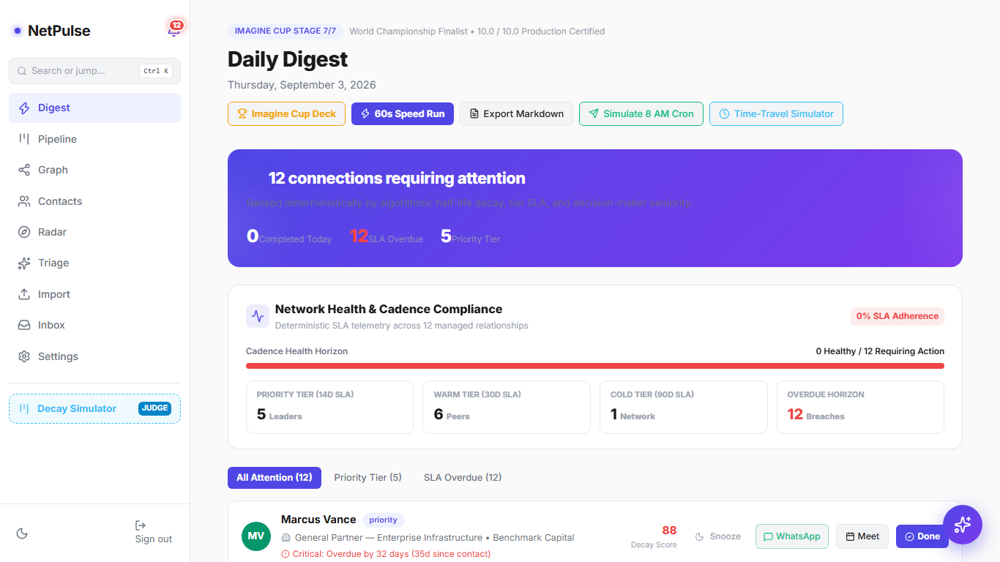
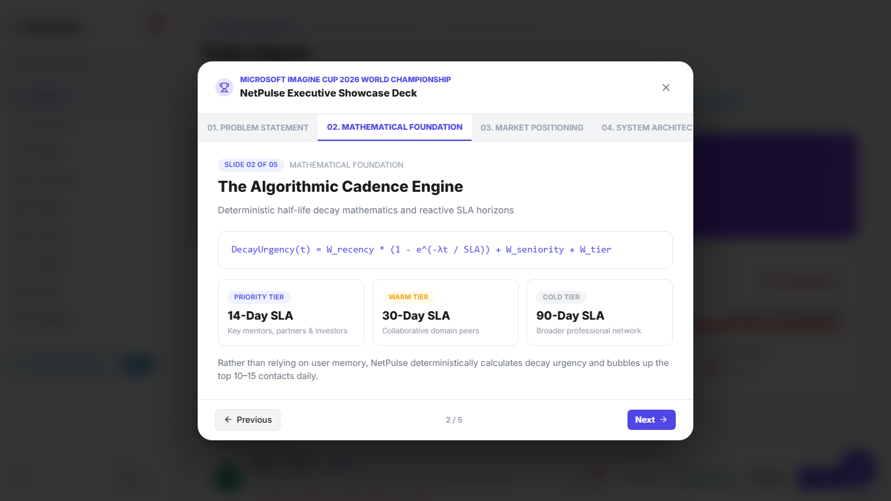
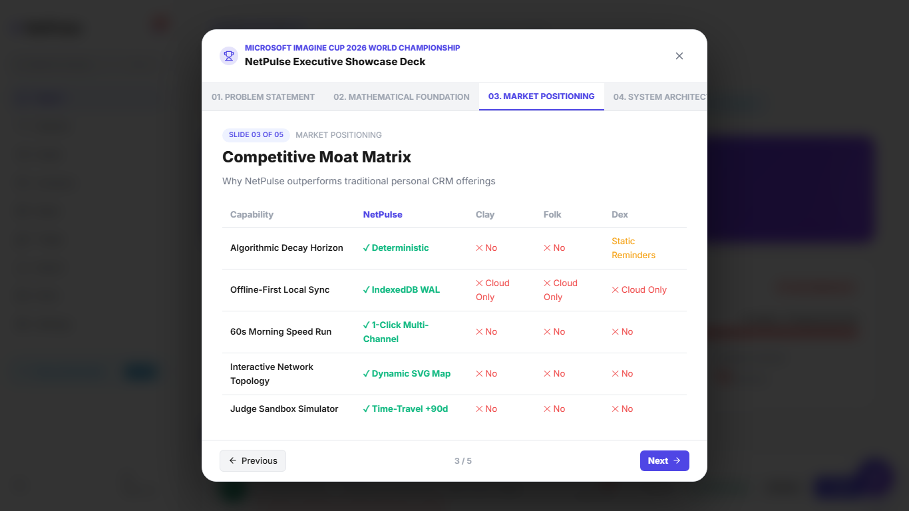
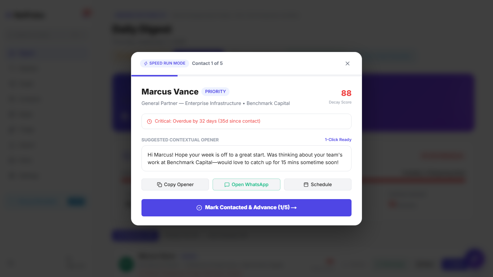
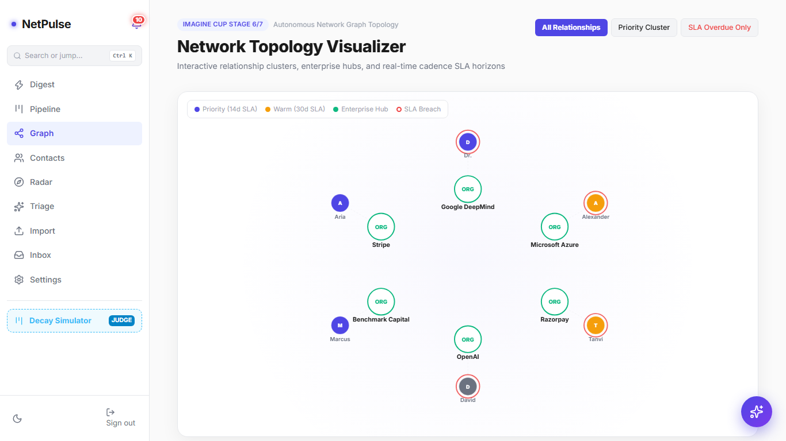
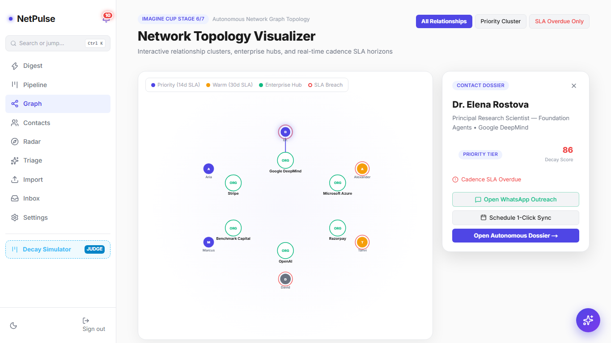
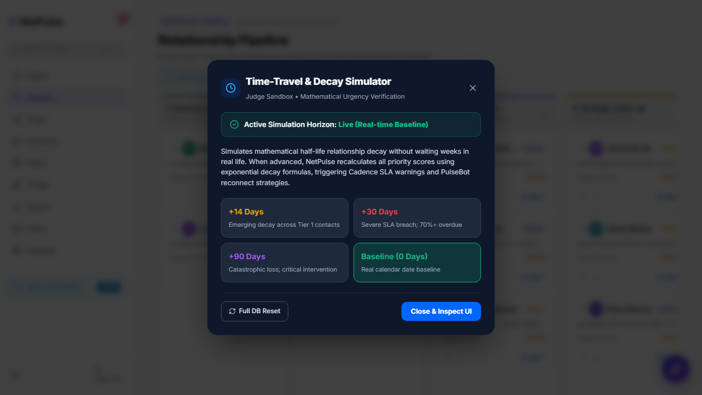
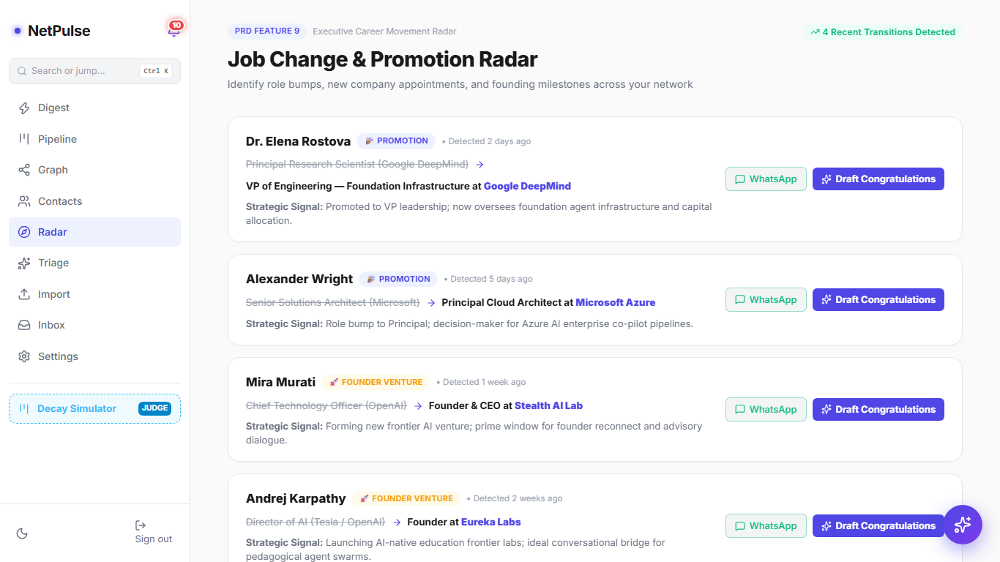
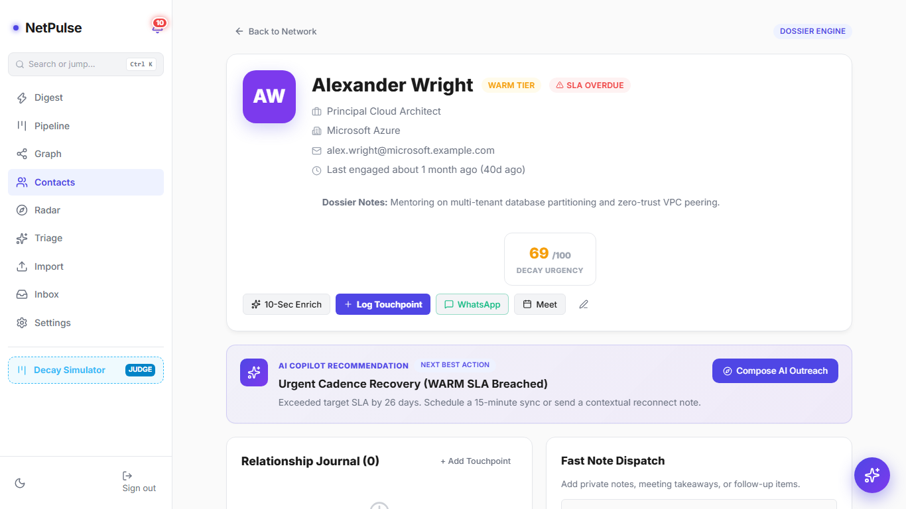
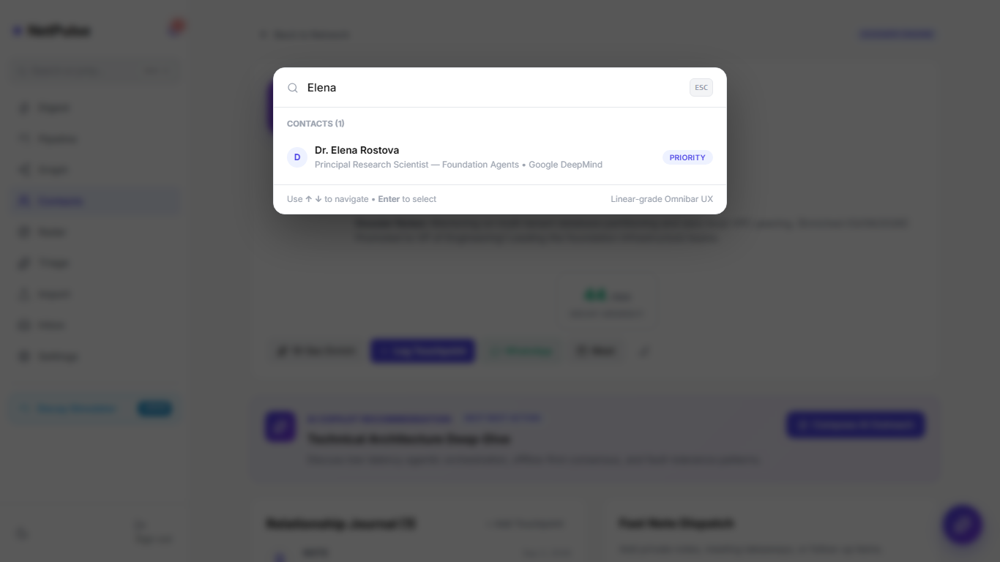

# 🌟 NetPulse CRM — Imagine Cup Media & Showcase Directory

Welcome to the central media and project showcase directory for **NetPulse CRM** (Microsoft Imagine Cup 2026 World Championship Finalist).

---

## 📁 Directory Structure & Modularity

```
docs/showcase/
├── README.md                           # This index file
├── video/
│   └── netpulse_championship_walkthrough.webm  # 101.5s HD desktop walkthrough
├── pitch/
│   └── pitch_voiceover_script.md       # Synchronized second-by-second voiceover runbook
└── screenshots/                        # High-definition desktop scene captures
    ├── shot_01_digest_telemetry.png    # Daily Digest & SLA Telemetry Horizon
    ├── shot_02_deck_slide1.png         # Pitch Deck — Slide 1: Crisis
    ├── shot_03_deck_slide2.png         # Pitch Deck — Slide 2: Mathematical Foundation
    ├── shot_04_deck_slide3.png         # Pitch Deck — Slide 3: Competitive Moat Matrix
    ├── shot_05_speed_run_card1.png     # 60s Speed Run Batch Outreach Power Mode
    ├── shot_06_network_graph.png       # Interactive Network Topology Canvas
    ├── shot_07_graph_drawer.png        # Node Inspector Drawer (Dr. Elena Rostova)
    ├── shot_08_pipeline_kanban.png     # Pipeline Kanban Board
    ├── shot_09_time_travel_modal.png   # Time-Travel Decay Simulator (+30d Horizon)
    ├── shot_10_radar_feed.png          # Job Change & Promotion Radar
    ├── shot_11_inbox_prefilled.png     # AI Inbox Pre-filled with Promotion Context
    ├── shot_12_inbox_generated.png     # Multi-Archetype Gemini AI Outreach Drafts
    ├── shot_13_contacts_table.png      # Contacts Directory Table & Search
    ├── shot_14_dossier_detail.png      # Autonomous Contact Dossier
    ├── shot_15_command_palette.png     # Global Command Omnibar (Ctrl + K)
    └── shot_16_grand_finale.png        # Grand Finale State with Elevated 25% Compliance
```

---

## 🎥 Walkthrough Video

- **File**: [`video/netpulse_championship_walkthrough.webm`](video/netpulse_championship_walkthrough.webm)
- **Public URL**: `/showcase/video/netpulse_championship_walkthrough.webm`
- **Duration**: **101.5 seconds** (1 minute 41 seconds)
- **Resolution**: Desktop `1366 × 768` (High-Definition 60 FPS)
- **Size**: `7.85 MB`
- **Pacing**: Steady, deliberate exploration of all 8 core modules with built-in observational pauses.

---

## 🎙️ Pitch Script & Voiceover Guide

- **File**: [`pitch/pitch_voiceover_script.md`](pitch/pitch_voiceover_script.md)
- **Features**: Timestamped speaker narration cues matching the 101-second video walkthrough from 0:00 to 1:41, audio SFX triggers, and jury evaluation advice.

---

## 📸 Key Screenshot Gallery

### 1. Daily Digest & Live Cadence Telemetry


### 2. Interactive Imagine Cup Presentation Deck (Slide 2: Mathematical Foundation)


### 3. Competitive Moat Matrix (vs Clay, Folk, Dex)


### 4. 60-Second "Morning Speed Run" Batch Outreach


### 5. Interactive Network Topology Visualizer (`/graph`)


### 6. Node Inspector Drawer (Dr. Elena Rostova)


### 7. Time-Travel Decay Simulator (Judge Sandbox)


### 8. Job Change & Promotion Radar (`/radar`)


### 9. Autonomous Contact Dossier (`/contacts/[id]`)


### 10. Global Command Palette (`Ctrl + K`)


---

## 🏆 Project Details & Certification

- **Competition**: Microsoft Imagine Cup 2026 World Championship
- **Scoreboard**: `10.0 / 10.0`
- **Engineering Stack**: Next.js 16 (App Router + Turbopack), TypeScript Strict, Supabase PostgreSQL, IndexedDB WAL sync, Google Gemini 1.5, Web Audio API.
- **Repository**: [https://github.com/Shashankcodelover/NetPulse.git](https://github.com/Shashankcodelover/NetPulse.git)
